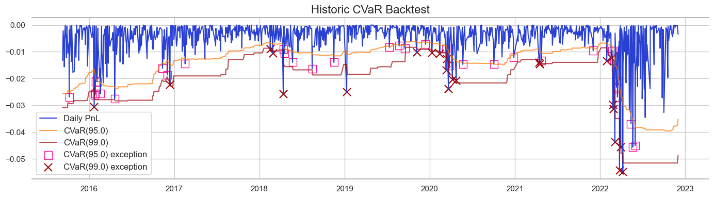

## 1. Data retrieval 
See [`RM_part1.ipynb`](RM_part1.ipynb).

For final dataset see [`Final_data.xlsx`](Final_data.xlsx).
## 2. Risk factors analysis 
See [`RM_part2.ipynb`](RM_part2.ipynb), [`data_stats.py`](data_stats.py).
## 3. Stochatic models 
See [`RM_part3.ipynb`](RM_part3.ipynb), [`stoch_models.py`](stoch_models.py).

Used models:
- $\ dX_{t} = a \ dt + b \ dW_{t}$
- $\ dX_{t} = a \ X_{t} \ dt + b \ X_{t} \ dW_{t}$
- $\ CIR: \ d X_{t} = a (b-X_{t})dt + c\sqrt{X_{t}} d W_{t} $

Best model can be chosen based on the metric:
- 'mape'
- 'mae'
- 'rmse'
## 4. Instrument modelling 
See [`RM_part4.ipynb`](RM_part4.ipynb), [`stoch_models_and_prediction.py`](stoch_models_and_prediction.py).

Used models:
- Linear regression
- LGBM

Best model can be chosen based on the metric:
- 'mape'
- 'mae'
- 'rmse'

PCA option available (set desired explainable variance).

## 5. VaR + ES and Backtesting
See [`RM_part5_VaR.ipynb`](RM_part5_VaR.ipynb).

[VaR](https://pypi.org/project/var/) (99%) and ES (97.5%) estimation methods:
- parametric
- historical
- bootstrapping

