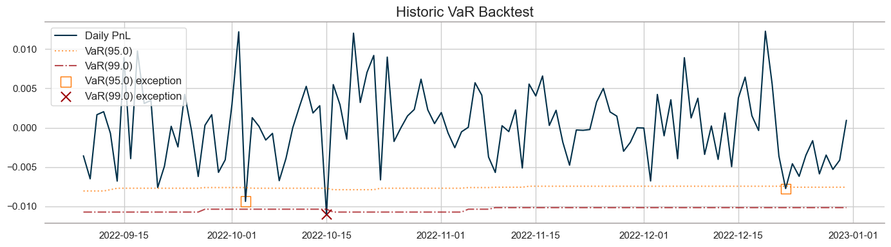
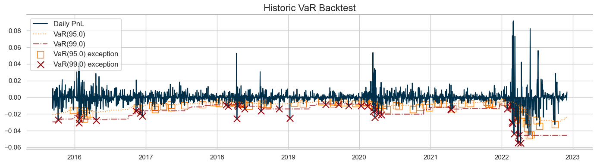

## 1. Data retrieval 
See [`RM_part1.ipynb`](RM_part1.ipynb).

For final dataset see [`/data/Final_data.xlsx`](../data/Final_data.xlsx).
## 2. Risk factors analysis 
See [`RM_part2.ipynb`](RM_part2.ipynb), [`data_stats.py`](data_stats.py).
## 3. Stochatic models 
See [`RM_part3.ipynb`](RM_part3.ipynb), [`stoch_models.py`](stoch_models.py).

Used models:
- $\ dX_{t} = a \ dt + b \ dW_{t}$
- $\ dX_{t} = a \ X_{t} \ dt + b \ X_{t} \ dW_{t}$
- $\ CIR: \ d X_{t} = a (b-X_{t})dt + c\sqrt{X_{t}} d W_{t} $

Best model can be chosen based on the metric:
- 'mape'
- 'mae'
- 'rmse'
## 4. Instrument modelling 
See [`RM_part4.ipynb`](RM_part4.ipynb), [`stoch_models_and_prediction.py`](stoch_models_and_prediction.py).

Used models:
- Linear regression
- LGBM

Best model can be chosen based on the metric:
- 'mape'
- 'mae'
- 'rmse'

PCA option available (set desired explainable variance).

## 5. VaR + ES and Backtesting
See [`RM_part5_VaR.ipynb`](RM_part5_VaR.ipynb), [`var_es.py`](var_es.py).

[VaR](https://pypi.org/project/var/) (99%) and ES (97.5%) estimation methods:
- parametric
- historical
- bootstrapping

### Simulations
```
╒════════════════════╤═════════════════════╤════════════════════════════════════════╕
│      Approach      │  Value at Risk 99%  │  Conditional Value at Risk (ES) 97.5%  │
╞════════════════════╪═════════════════════╪════════════════════════════════════════╡
│   Parametric, 1d   │       -0.0119       │                -0.0126                 │
├────────────────────┼─────────────────────┼────────────────────────────────────────┤
│   Historical, 1d   │       -0.0122       │                -0.0115                 │
├────────────────────┼─────────────────────┼────────────────────────────────────────┤
│  Parametric, 10d   │       -0.0375       │                -0.0397                 │
├────────────────────┼─────────────────────┼────────────────────────────────────────┤
│  Historical, 10d   │       -0.0385       │                -0.0364                 │
├────────────────────┼─────────────────────┼────────────────────────────────────────┤
│ Bootstrapping, 1d  │       -0.0110       │                -0.0115                 │
├────────────────────┼─────────────────────┼────────────────────────────────────────┤
│ Bootstrapping, 10d │       -0.0348       │                -0.0364                 │
╘════════════════════╧═════════════════════╧════════════════════════════════════════╛
```



For backtesting results on subportfolio (stocks, bonds and currencies) see `/results/images`.

### Historical data
```
╒════════════════════╤═════════════════════╤════════════════════════════════════════╕
│      Approach      │  Value at Risk 99%  │  Conditional Value at Risk (ES) 97.5%  │
╞════════════════════╪═════════════════════╪════════════════════════════════════════╡
│   Parametric, 1d   │       -0.0194       │                -0.0260                 │
├────────────────────┼─────────────────────┼────────────────────────────────────────┤
│   Historical, 1d   │       -0.0256       │                -0.0254                 │
├────────────────────┼─────────────────────┼────────────────────────────────────────┤
│  Parametric, 10d   │       -0.0614       │                -0.0823                 │
├────────────────────┼─────────────────────┼────────────────────────────────────────┤
│  Historical, 10d   │       -0.0810       │                -0.0802                 │
├────────────────────┼─────────────────────┼────────────────────────────────────────┤
│ Bootstrapping, 1d  │       -0.0250       │                -0.0255                 │
├────────────────────┼─────────────────────┼────────────────────────────────────────┤
│ Bootstrapping, 10d │       -0.0790       │                -0.0806                 │
╘════════════════════╧═════════════════════╧════════════════════════════════════════╛
```



